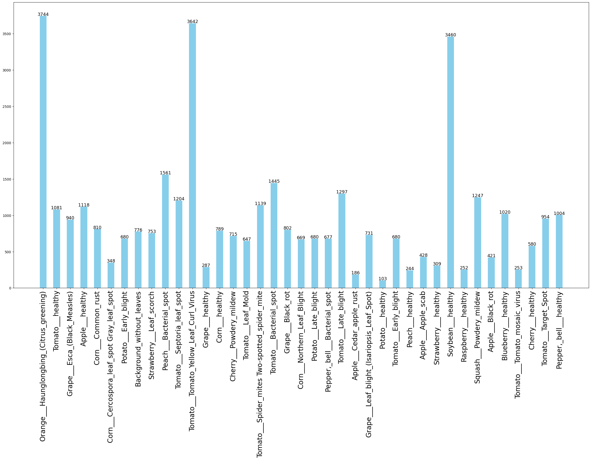
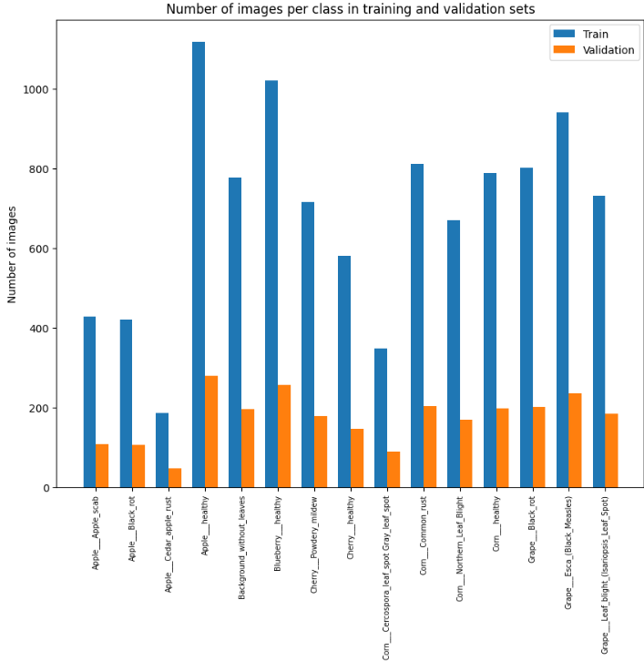
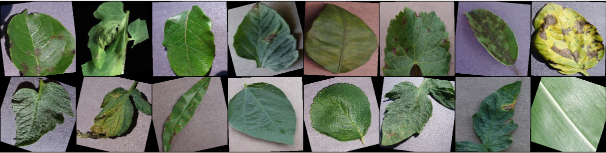
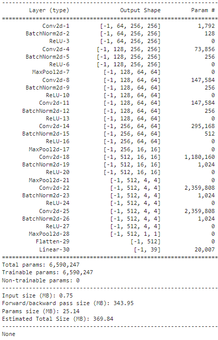
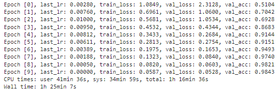
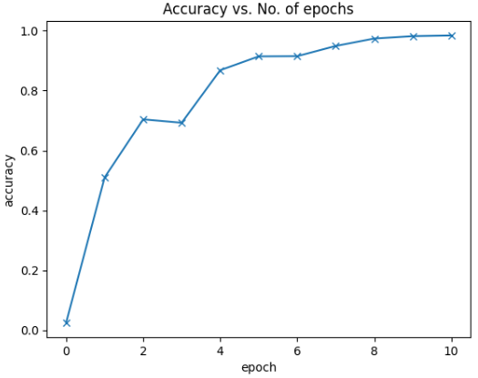

# Plant Disease Classification using Deep Learning


### Description
This repository contains a deep learning approach to classify plant diseases from images. It includes data preprocessing, augmentation, and model training using PyTorch to build a robust classifier.

### Table of Contents
1. [Introduction](#introduction)
2. [Dataset](#dataset)
3. [Setup and Installation](#setup-and-installation)
4. [Data Preparation](#data-preparation)
   - [Extracting the Dataset](#extracting-the-dataset)
   - [Splitting the Data](#splitting-the-data)
   - [Visualizing and Analyzing the Dataset](#visualizing-and-analyzing-the-dataset)
   - [Data Augmentation](#data-augmentation)
5. [Model Architecture](#model-architecture)
   - [Residual Block Implementation](#residual-block-implementation)
   - [Accuracy Calculation](#accuracy-calculation)
   - [Convolution Block with BatchNormalization](#convolution-block-with-batchnormalization)
6. [Training the Model](#training-the-model)
7. [Results](#results)
8. [Contributing](#contributing)

## Introduction
This project aims to classify plant diseases using images with a deep learning model built in PyTorch. The approach includes data augmentation to enhance model performance.

## Dataset
- **Description**: Images of various plant diseases.
- **Split**: 80% training, 20% validation.
- **Dataset Link**: [Kaggle - Plant Disease](https://www.kaggle.com/datasets/emmarex/plantdisease/data) 
<p align="center">
  
</p>

## Setup and Installation
1. Clone the repository:
    ```bash
    git clone https://github.com/KhalidMustafaElenani/Plant-Disease-Classification-ResNet.git
    ```
2. Navigate to the project directory:
    ```bash
    cd Plant-Disease-Classification-ResNet
    ```
3. Download the dataset:
    ```bash
    kaggle datasets download -d emmarex/plantdisease
    ```

## Data Preparation
### Extracting the Dataset
```python
from google.colab import drive
import zipfile

drive.mount("/content/drive", force_remount=True)
data_dir = '/content/drive/My Drive/data.zip'
extract_to_dir = '/content/extracted_data'
with zipfile.ZipFile(data_dir, 'r') as zip_ref:
    zip_ref.extractall(extract_to_dir)

```

### Splitting the Data
Split the dataset into training and validation sets:
```python
import splitfolders

input_folder = '/content/extracted_data/Data'
output_folder = '/content/train_val_data'
splitfolders.ratio(input_folder, output=output_folder, seed=1337, ratio=(.8, .2))
```

### Visualizing and Analyzing the Dataset
Visualize the distribution of images in the training and validation sets:
```python
def plot_train_val_distribution(train_dir, val_dir, num_classes):
    # Implementation here
    pass

plot_train_val_distribution(train_dir, valid_dir, num_classes=15)
```
<p align="center">
  
</p>

### Data Augmentation
Apply data augmentation to the training dataset:
```python
from torchvision import transforms

train_transforms = transforms.Compose([
    transforms.RandomResizedCrop(256, scale=(0.8, 1.0)),
    transforms.RandomHorizontalFlip(),
    transforms.RandomVerticalFlip(),
    transforms.RandomRotation(20),
    transforms.ToTensor()
])

valid_transforms = transforms.Compose([transforms.ToTensor()])

def augment_all_images(input_dir, output_dir, transform):
    # Implementation here
    pass

augment_all_images(train_dir, augmented_train_dir, train_transforms)
```
<p align="center">
  
</p>

## Model Architecture
### Residual Block Implementation
Implement a simple residual block:
```python
import torch
import torch.nn as nn

class SimpleResidualBlock(nn.Module):
    def __init__(self):
        super().__init__()
        self.conv1 = nn.Conv2d(3, 3, 3, padding=1)
        self.relu1 = nn.ReLU()
        self.conv2 = nn.Conv2d(3, 3, 3, padding=1)
        self.relu2 = nn.ReLU()

    def forward(self, x):
        out = self.conv1(x)
        out = self.relu1(out)
        out = self.conv2(out)
        return self.relu2(out) + x
```
<p align="center">
  
</p>

### Accuracy Calculation
Define a function to calculate the accuracy of model predictions:
```python
def accuracy(outputs, labels):
    _, preds = torch.max(outputs, dim=1)
    return torch.tensor(torch.sum(preds == labels).item() / len(preds))
```

### Convolution Block with BatchNormalization
Define a convolution block with BatchNormalization:
```python
def ConvBlock(in_channels, out_channels, pool=False):
    # Implementation here
    pass
```

## Training the Model
Train the model using the training and validation datasets:
```python
def train_model(model, train_dl, valid_dl, num_epochs, lr, optimizer_func=torch.optim.SGD):
    # Implementation here
    pass

model = YourModel()
train_model(model, train_dl, valid_dl, num_epochs=25, lr=0.001)
```
<p align="center">
  
</p>

## Results
Visualize the training and validation results:
```python
import matplotlib.pyplot as plt

def plot_results(results):
    epochs = range(1, len(results['train_loss']) + 1)
    plt.figure(figsize=(12, 6))
    plt.plot(epochs, results['train_loss'], label='Training Loss')
    plt.plot(epochs, results['valid_loss'], label='Validation Loss')
    plt.plot(epochs, results['train_acc'], label='Training Accuracy')
    plt.plot(epochs, results['valid_acc'], label='Validation Accuracy')
    plt.xlabel('Epoch')
    plt.ylabel('Value')
    plt.title('Training and Validation Loss and Accuracy')
    plt.legend()
    plt.show()

plot_results(training_results)
```
<p align="center">
  
</p>

## Contributing
-   Contributions are welcome! Please submit a pull request or open an issue for suggestions and improvements.
-   Feel free to adjust any specific details or add additional sections as needed!


